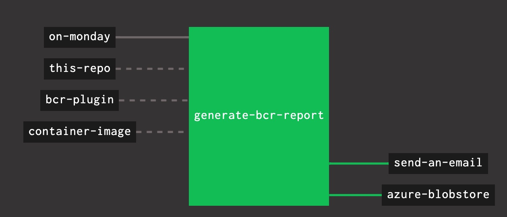

# BCR Pipeline

This pipeline's goal is to run the [cf bcr plugin](https://github.com/avasseur-pivotal/cf_get_events) on a weekly basis and display the result in the task.
This pipeline will run every monday by default and output the result in the `report` concourse output.
You can then add a task to send the result by [email](https://github.com/pivotal-cf/email-resource) or on [slack](https://github.com/cloudfoundry-community/slack-notification-resource)



# Usage
## Parameter file
Complete the parameter file and store if where you want
```yaml
this_git_repo_uri: https://github.com/RomRider/bcr-pipeline.git
this_git_repo_branch: master
# Image used to run the container. Needs to embed at least the cf cli
container_image_repository: pcfnorm/rootfs
# Your github access token to avoid being blocked by github
github_access_token:
# CF API informations
cf_api_url:
# Optionnal if you store the value in crehdub
cf_api_login:
cf_api_password:
```

## Deploying the pipeline
Then set the pipeline using:
```sh
fly -t <YOUR_TARGET> sp -p bcr-report -c pipeline.yml -l <YOUR_PARAM_FILE>
fly -t <YOUR_TARGET> up -p bcr-report
```

## Known issues
* **The time resource doesn't produce a resource version initially**

  Because of the way the [time resource](https://github.com/concourse/time-resource) works, the `on-monday` will only produce it's first version on the next Monday. a feature   request is opened to fix this issue [here](https://github.com/concourse/time-resource/issues/11)

  To test the pipeline without waiting you can change the resource declaration in the `pipeline.yml` file:
  ```yaml
    - name: on-monday
      type: time
      source:
        # days: [Monday]  <<<<< Comment out this line and set your pipeline again
        interval: 24h
  ```

